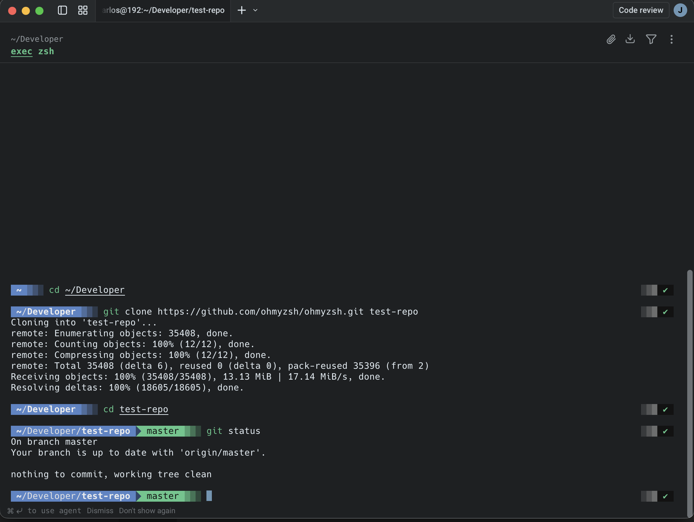
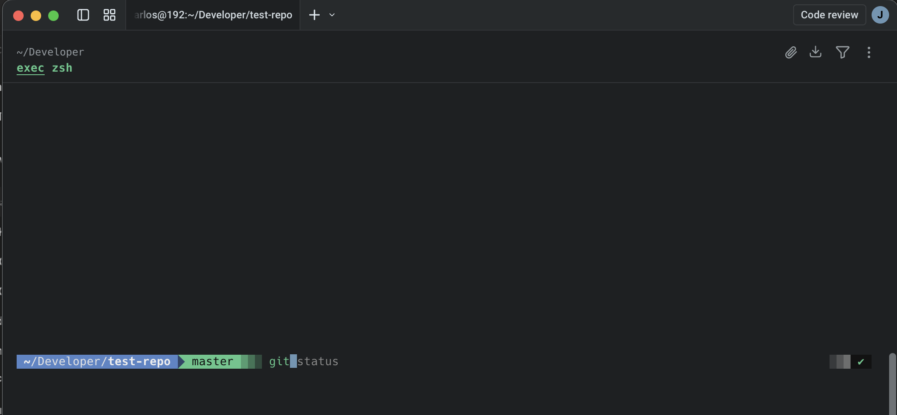
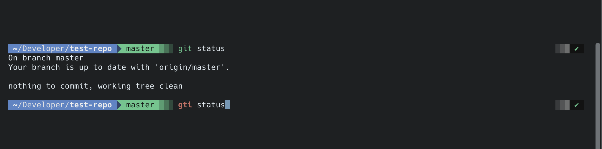
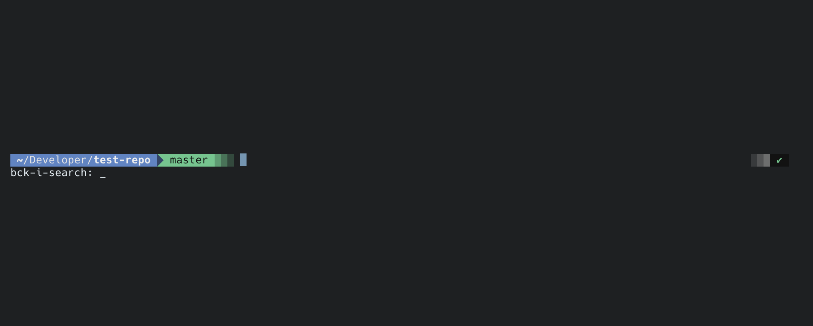

# 🚀 Jean Dev Environment

---

## 🖥️ Preview

### 🎨 Powerlevel10k Prompt

<p align="center">
  
</p>

---

### ⚡ Autosuggestions

<p align="center">
  
</p>

---

### 🎯 Syntax Highlighting

<p align="center">
  
</p>

---

### 🔎 FZF History Search

<p align="center">
  
</p>

Bootstrap script to recreate my macOS development setup in minutes.

---

## ✨ What It Installs

- ZSH plugins
- Powerlevel10k
- zsh-autosuggestions
- zsh-syntax-highlighting
- FZF
- Productivity aliases

---

## 🔐 Safe & Idempotent

- Does not overwrite existing `.zshrc`
- Creates backup automatically
- Installs only missing packages
- Can be executed multiple times safely

---

## 📦 Installation

```bash
git clone https://github.com/your-username/jean-dev-environment.git
cd jean-dev-environment
chmod +x mac-dev-setup
./mac-dev-setup
```

---

## 🧠 Why?

Rebuilding a development environment from scratch is painful and time-consuming.

This script transforms setup into code — fast, reproducible and versioned.

**Setup as code > Manual setup.**

By versioning your environment configuration, you:

- Reduce friction
- Avoid inconsistencies across machines
- Improve onboarding speed
- Increase productivity

---

## 🛠️ Stack

- Homebrew
- ZSH
- Powerlevel10k
- Warp Terminal (recommended)

---

## 📌 Future Improvements

- Xcode CLI Tools
- Node / NVM
- Ruby / Bundler
- CocoaPods
- SwiftLint
- Git global config automation
